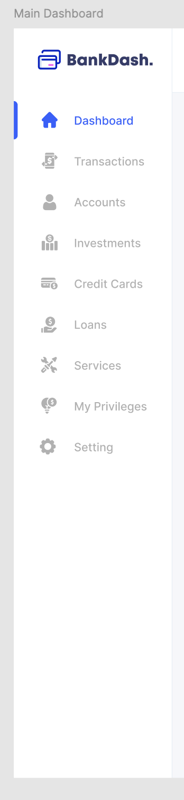

# PDD - Angular

# Exercice 1 : Prompting

## Objectif

L'objectif de cet exercice est de vous familiariser avec le prompting

## Consignes

Réaliser le menu d'une application en passant en paramètres la capture d'écran correspondante

# Exercice 2 : Contextualiser

## Objectif

L'objectif de cet exercice est de vous familiariser avec la notion de contexte.

## Consignes

- Ecrire des règles de prompting pour réaliser les tâches suivantes. Ces règles doivent être à la racine du projet dans un fichier `.clinerules.md`.
- Ecrire les tests de composants et d'architecture nécessaires pour spécifier et valider la réalisation du menu de l'application.
- Bonus : En vous appuyant sur ces règles réaliser le menu d'une application en passant en paramètres la capture d'écran correspondante

